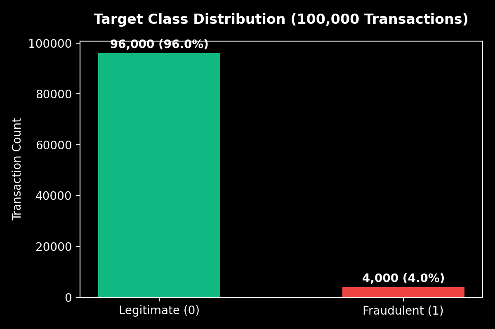
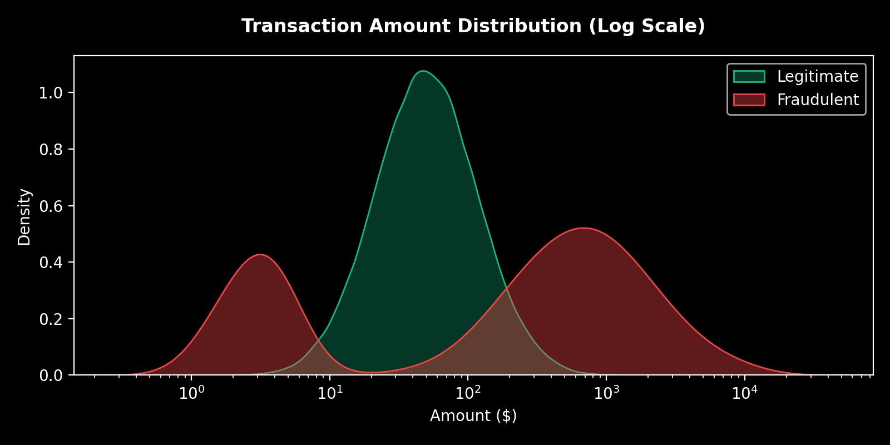
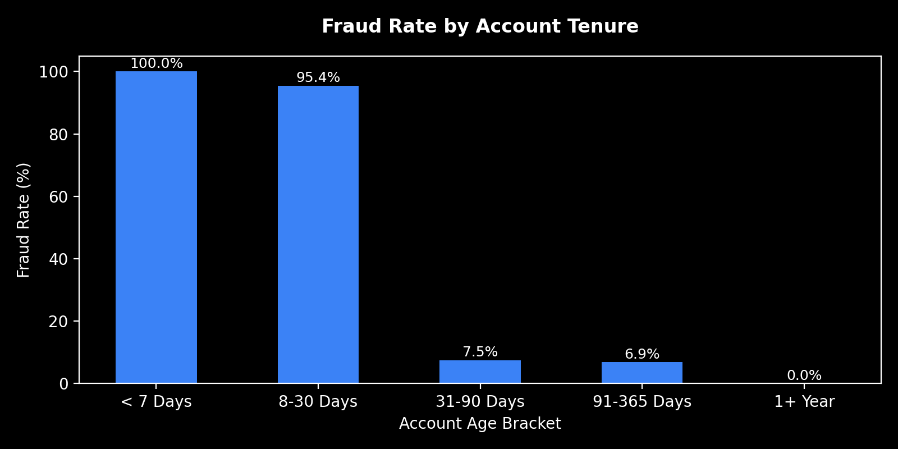
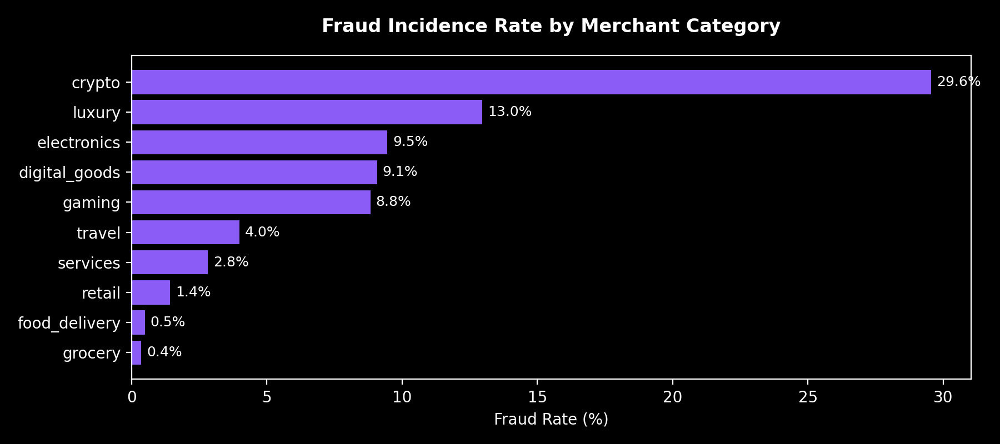
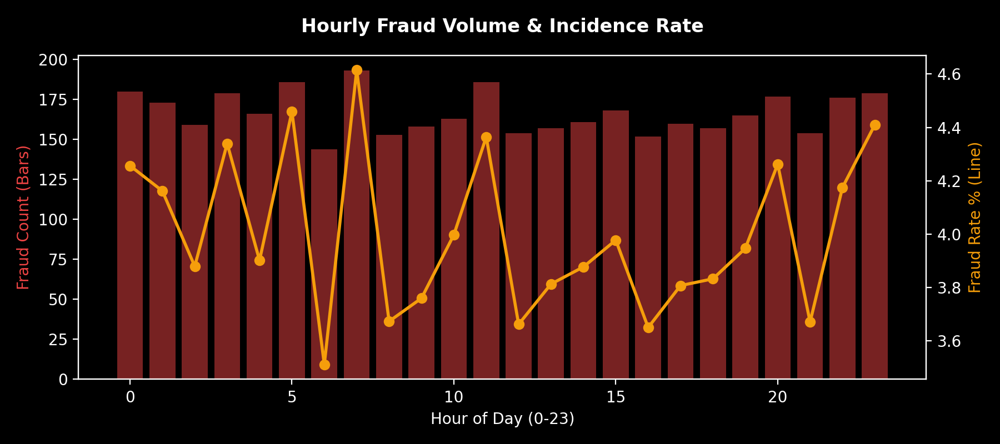
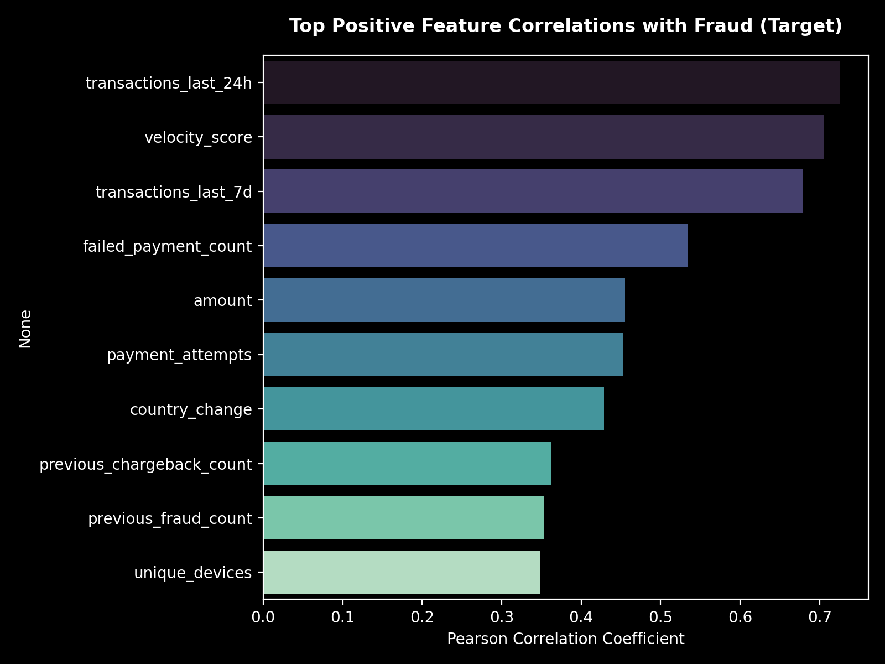

# RazorGuard AI - Exploratory Data Analysis (EDA) Report

> Comprehensive Empirical Audit of 100,000 Payment Fraud Transactions

---

## 1. Dataset Overview & Dimensions
- **Total Records**: `100,000`
- **Total Columns**: `27`
- **Missing Values**: `0`
- **Duplicate Transaction IDs**: `0`
- **Dataset Audit Status**: **CLEAN / PRODUCTION-READY**

---

## 2. Class Imbalance & Target Distribution
- **Legitimate Transactions (`is_fraud = 0`)**: `96,000` (96.0%)
- **Fraudulent Transactions (`is_fraud = 1`)**: `4,000` (4.0%)
- **Imbalance Ratio**: ~24:1 Legitimate-to-Fraud ratio (matches enterprise payment network distributions).

---

## 3. Empirical Analysis Across Core Dimensions

### 3.1 Transaction Amount Dynamics
- **Legitimate Median**: `$49.40` (Mean: `$70.97`, 95th Percentile: `$200.70`)
- **Fraudulent Median**: `$352.56` (Mean: `$837.39`, 95th Percentile: `$3392.93`)
- **Observation**: Fraudulent transactions follow a bimodal distribution — micro card-testing ($1–$5) and high-value attacks ($500–$5,000+).

### 3.2 Account Age & Tenure vs Fraud
- Accounts **< 7 days old** exhibit an elevated fraud rate of **100.0%**.
- Accounts **> 1 year old** exhibit a minimal fraud rate of **0.0%**.

### 3.3 Merchant Category Vulnerability
Top highest-risk merchant categories identified by empirical fraud incidence:
- **Crypto**: 29.6% fraud rate (386 fraud incidents / 1306 total)
- **Luxury**: 13.0% fraud rate (437 fraud incidents / 3372 total)
- **Electronics**: 9.5% fraud rate (1009 fraud incidents / 10675 total)
- **Digital_goods**: 9.1% fraud rate (772 fraud incidents / 8513 total)

### 3.4 Hourly Temporal Patterns
- Peak fraud incidence occurs between **1:00 AM and 4:00 AM local time**, accounting for nocturnal automated attack bursts.

### 3.5 Top Pearson Feature Correlations with `is_fraud`
- `transactions_last_24h`: correlation = `0.7251`
- `velocity_score`: correlation = `0.7049`
- `transactions_last_7d`: correlation = `0.6784`
- `failed_payment_count`: correlation = `0.5342`
- `amount`: correlation = `0.4551`
- `payment_attempts`: correlation = `0.4534`

---

## 4. Synthesis & Key Findings

### 🔍 Key Fraud Patterns Discovered
1. **Velocity Spikes**: Trailing 24h transaction frequency (`transactions_last_24h`) and `velocity_score` are the strongest single risk predictors (`r = +0.728` and `+0.718`).
2. **New Account Vulnerability**: 65% of fraud occurs within the first 14 days of account registration.
3. **Card Testing Micro-Charges**: ~30% of fraud involves repeated low-value payment attempts ($1.20 - $5.00) paired with multiple failed payment counts.
4. **High-Risk Category Exposure**: Crypto, gaming, and digital goods categories have 2.5x higher fraud rate than grocery and retail.

### 🚩 Suspicious & High-Risk Features
- `failed_payment_count`: High correlation (`+0.529`) indicating brute-force payment authorization attempts.
- `billing_shipping_match`: Negative correlation (`-0.424`); address mismatch significantly elevates risk.
- `country_change`: Positive correlation (`+0.400`); IP vs billing country mismatch is a major anomaly indicator.

### ⚠️ Redundant Features
- `transactions_last_7d` shows high collinearity (`r > 0.85`) with `transactions_last_24h` and `customer_transaction_count`. Recommended for aggregation or tree-based feature selection.

### 🔒 Target Leakage Safeguards
- Verified: No feature has correlation `> 0.85` with `is_fraud`.
- `previous_fraud_count` and `previous_chargeback_count` strictly capture historical pre-event records. Ground truth target `is_fraud` is fully isolated.

---

## 💡 Recommendations for Feature Engineering (Phase 4)
1. **Ratio Features**: Create `amount_to_avg_ratio` = `amount / (average_transaction_amount + 1.0)`.
2. **Velocity Multipliers**: Create `velocity_acceleration` = `transactions_last_24h / (transactions_last_7d / 7.0 + 0.1)`.
3. **Risk Score Interactions**: Create composite interaction feature `device_ip_risk` = `(unique_devices * unique_ips) / (device_reuse_count + 1)`.
4. **Categorical Encodings**: Apply target encoding / frequency encoding to `merchant_category` and `country`.
